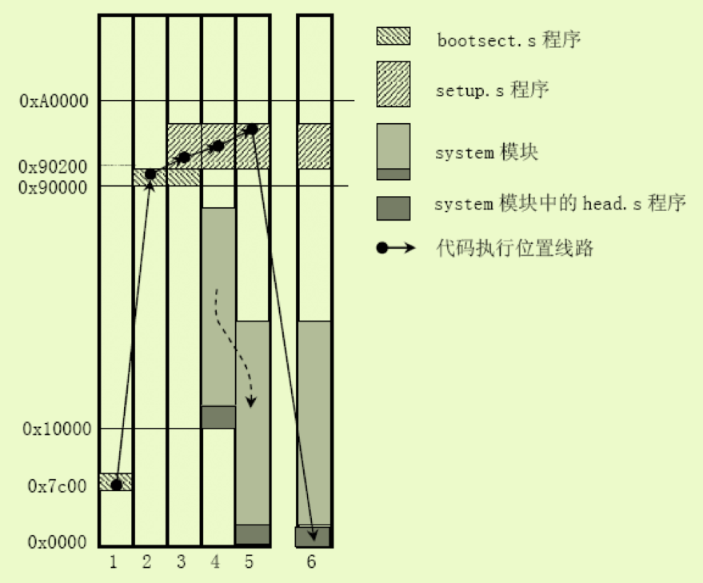

# 主要功能
bootsect 在启动时会被加载到`0x7c00`处 将会编译为`512`字节的文件,中间填充0，其主要功能如下
+ 加载以及移动代码，完整过程如下图所示
  
+ 从实模式转换到保护模式
+ 搭建好C语言运行环境
+ 跳到main.c中执行
# 代码分析
## bootsect
### 移动bootsect
将`bootsect`移动到`0x90000-0x90200`处，并将栈顶设置为`0x9FF00`处(`0X9FF00 = 0X9000<<4 + 0XFF00`)
```
_start:
	mov	$BOOTSEG, %ax	#将ds段寄存器设置为0x7C00
	mov	%ax, %ds
	mov	$INITSEG, %ax	#将es段寄存器设置为0x9000
	mov	%ax, %es
	mov	$256, %cx		#设置移动计数值256字
	sub	%si, %si		#源地址	ds:si = 0x07C0:0x0000
	sub	%di, %di		#目标地址 es:si = 0x9000:0x0000
	rep					#重复执行并递减cx的值
	movsw				#从内存[si]处移动cx个字到[di]处
	ljmp	$INITSEG, $go	#段间跳转，这里INITSEG指出跳转到的段地址，解释了cs的值为0x9000
go:	mov	%cs, %ax		#将ds，es，ss都设置成移动后代码所在的段处(0x9000)
	mov	%ax, %ds
	mov	%ax, %es
# put stack at 0x9ff00.
	mov	%ax, %ss
	mov	$0xFF00, %sp		# arbitrary value >>512
```
### 加载setup到`0x90200`
```
# load the setup-sectors directly after the bootblock.
# Note that 'es' is already set up.

#
##ah=0x02 读磁盘扇区到内存	al＝需要独出的扇区数量
##ch=磁道(柱面)号的低八位   cl＝开始扇区(位0-5),磁道号高2位(位6－7)
##dh=磁头号					dl=驱动器号(硬盘则7要置位)
##es:bx ->指向数据缓冲区；如果出错则CF标志置位,ah中是出错码
#
load_setup:
	mov	$0x0000, %dx		# drive 0, head 0
	mov	$0x0002, %cx		# sector 2, track 0
	mov	$0x0200, %bx		# address = 512, in INITSEG
	.equ    AX, 0x0200+SETUPLEN
	mov     $AX, %ax		# service 2, nr of sectors
	int	$0x13			# read it
	jnc	ok_load_setup		# ok - continue
	mov	$0x0000, %dx
	mov	$0x0000, %ax		# reset the diskette
	int	$0x13
	jmp	load_setup

```
### 获取磁盘参数
主要是为了获取扇区数，即cx
```
ok_load_setup:

# Get disk drive parameters, specifically nr of sectors/track

	mov	$0x00, %dl
	mov	$0x0800, %ax		# AH=8 is get drive parameters
	int	$0x13			# after this，eax=0 edx=0x101 ecx=0x94f12 es=0xf000 edi=0xefde
	mov	$0x00, %ch
	#seg cs
	mov	%cx, %cs:sectors+0	# 将cx 存入到sectors中
	mov	$INITSEG, %ax
	mov	%ax, %es
```
### print msg to screen
```
# Print some inane message

	mov	$0x03, %ah		# read cursor pos
	xor	%bh, %bh
	int	$0x10
	
	mov	$30, %cx
	mov	$0x0007, %bx		# page 0, attribute 7 (normal)
	#lea	msg1, %bp
	mov     $msg1, %bp
	mov	$0x1301, %ax		# write string, move cursor
	int	$0x10
```
### 读取system到0x10000
这个读取逻辑没有详细去跟
```
# ok, we've written the message, now
# we want to load the system (at 0x10000)

	mov	$SYSSEG, %ax
	mov	%ax, %es		# segment of 0x010000
	call	read_it
	call	kill_motor
```
### 判断根设备并跳转到setup
此处我们的代码已经将root_dev设置为了0x301,因此会自截跳转到setup
```
# After that we check which root-device to use. If the device is
# defined (#= 0), nothing is done and the given device is used.
# Otherwise, either /dev/PS0 (2,28) or /dev/at0 (2,8), depending
# on the number of sectors that the BIOS reports currently.

	#seg cs
	mov	%cs:root_dev+0, %ax
	cmp	$0, %ax
	jne	root_defined
root_defined:
	#seg cs
	mov	%ax, %cs:root_dev+0
# after that (everyting loaded), we jump to
# the setup-routine loaded directly after
# the bootblock:

	ljmp	$SETUPSEG, $0
```
## setup
