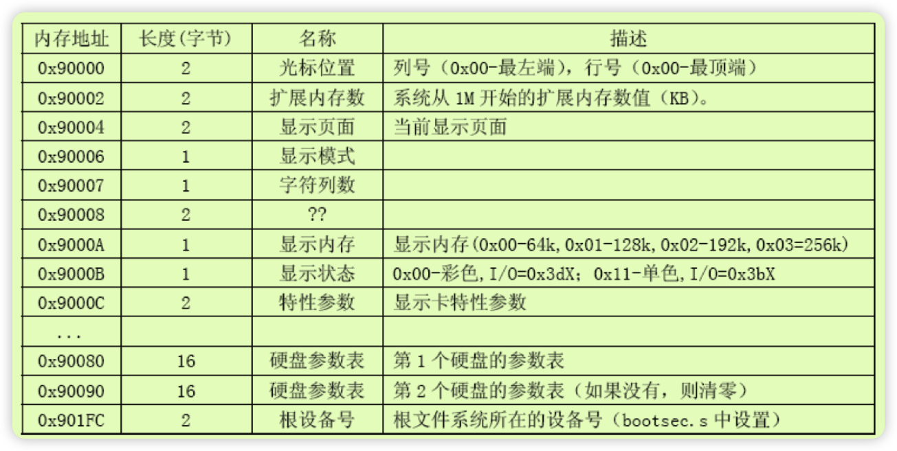
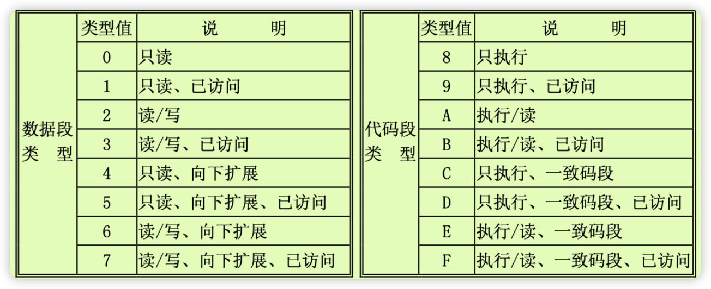
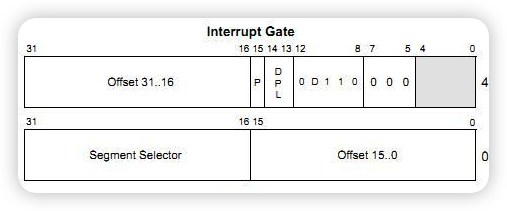

# 主要功能
bootsect 在启动时会被加载到`0x7c00`处 将会编译为`512`字节的文件,中间填充0，其主要功能如下
+ 加载以及移动代码，完整过程如下图所示(出自内核源码全注释)
  
+ 读取硬件参数
	主要读取的硬件参数如下(出自内核源码全注释)
	
+ 从实模式转换到保护模式
+ 跳到system进行执行
# 代码分析
## bootsect
### 移动bootsect
将`bootsect`移动到`0x90000-0x90200`处，并将栈顶设置为`0x9FF00`处(`0X9FF00 = 0X9000<<4 + 0XFF00`)
```
_start:
	mov	$BOOTSEG, %ax	#将ds段寄存器设置为0x7C00
	mov	%ax, %ds
	mov	$INITSEG, %ax	#将es段寄存器设置为0x9000
	mov	%ax, %es
	mov	$256, %cx		#设置移动计数值256字
	sub	%si, %si		#源地址	ds:si = 0x07C0:0x0000
	sub	%di, %di		#目标地址 es:si = 0x9000:0x0000
	rep					#重复执行并递减cx的值
	movsw				#从内存[si]处移动cx个字到[di]处
	ljmp	$INITSEG, $go	#段间跳转，这里INITSEG指出跳转到的段地址，解释了cs的值为0x9000
go:	mov	%cs, %ax		#将ds，es，ss都设置成移动后代码所在的段处(0x9000)
	mov	%ax, %ds
	mov	%ax, %es
# put stack at 0x9ff00.
	mov	%ax, %ss
	mov	$0xFF00, %sp		# arbitrary value >>512
```
### 加载setup到`0x90200`
```
# load the setup-sectors directly after the bootblock.
# Note that 'es' is already set up.

#
##ah=0x02 读磁盘扇区到内存	al＝需要独出的扇区数量
##ch=磁道(柱面)号的低八位   cl＝开始扇区(位0-5),磁道号高2位(位6－7)
##dh=磁头号					dl=驱动器号(硬盘则7要置位)
##es:bx ->指向数据缓冲区；如果出错则CF标志置位,ah中是出错码
#
load_setup:
	mov	$0x0000, %dx		# drive 0, head 0
	mov	$0x0002, %cx		# sector 2, track 0
	mov	$0x0200, %bx		# address = 512, in INITSEG
	.equ    AX, 0x0200+SETUPLEN
	mov     $AX, %ax		# service 2, nr of sectors
	int	$0x13			# read it
	jnc	ok_load_setup		# ok - continue
	mov	$0x0000, %dx
	mov	$0x0000, %ax		# reset the diskette
	int	$0x13
	jmp	load_setup

```
### 获取磁盘参数
主要是为了获取扇区数，即cx
```
ok_load_setup:

# Get disk drive parameters, specifically nr of sectors/track

	mov	$0x00, %dl
	mov	$0x0800, %ax		# AH=8 is get drive parameters
	int	$0x13			# after this，eax=0 edx=0x101 ecx=0x94f12 es=0xf000 edi=0xefde
	mov	$0x00, %ch
	#seg cs
	mov	%cx, %cs:sectors+0	# 将cx 存入到sectors中
	mov	$INITSEG, %ax
	mov	%ax, %es
```
### print msg to screen
```
# Print some inane message

	mov	$0x03, %ah		# read cursor pos
	xor	%bh, %bh
	int	$0x10
	
	mov	$30, %cx
	mov	$0x0007, %bx		# page 0, attribute 7 (normal)
	#lea	msg1, %bp
	mov     $msg1, %bp
	mov	$0x1301, %ax		# write string, move cursor
	int	$0x10
```
### 读取system到0x10000
这个读取逻辑没有详细去跟
```
# ok, we've written the message, now
# we want to load the system (at 0x10000)

	mov	$SYSSEG, %ax
	mov	%ax, %es		# segment of 0x010000
	call	read_it
	call	kill_motor
```
### 判断根设备并跳转到setup
此处我们的代码已经将root_dev设置为了0x301,因此会自截跳转到setup
```
# After that we check which root-device to use. If the device is
# defined (#= 0), nothing is done and the given device is used.
# Otherwise, either /dev/PS0 (2,28) or /dev/at0 (2,8), depending
# on the number of sectors that the BIOS reports currently.

	#seg cs
	mov	%cs:root_dev+0, %ax
	cmp	$0, %ax
	jne	root_defined
root_defined:
	#seg cs
	mov	%ax, %cs:root_dev+0
# after that (everyting loaded), we jump to
# the setup-routine loaded directly after
# the bootblock:

	ljmp	$SETUPSEG, $0
```
## setup

### 获取硬件数据
+ 获取光标

	```s
	# ok, the read went well so we get current cursor position and save it for
	# posterity.
		#xchgw	%bx, %bx
		mov	$INITSEG, %ax	# this is done in bootsect already, but...
		mov	%ax, %ds
		mov	$0x03, %ah	# read cursor pos
		xor	%bh, %bh
		int	$0x10		# save it in known place, con_init fetches
		mov	%dx, %ds:0	# it from 0x90000.
	```

+ 获取额外的memory大小
	```s
	# ok, the read went well so we get current cursor position and save it for
	# posterity.
		#xchgw	%bx, %bx
		mov	$INITSEG, %ax	# this is done in bootsect already, but...
		mov	%ax, %ds
		mov	$0x03, %ah	# read cursor pos
		xor	%bh, %bh
		int	$0x10		# save it in known place, con_init fetches
		mov	%dx, %ds:0	# it from 0x90000.
	```
+ 获取显示参数
	```s
	# Get video-card data: and save to 0x90004-0x90008

		mov	$0x0f, %ah
		int	$0x10
		mov	%bx, %ds:4	# bh = display page
		mov	%ax, %ds:6	# al = video mode, ah = window width

	# check for EGA/VGA and some config parameters

		mov	$0x12, %ah
		mov	$0x10, %bl
		int	$0x10
		mov	%ax, %ds:8
		mov	%bx, %ds:10
		mov	%cx, %ds:12
	```
+ 获取硬盘参数
	```s
	# Get video-card data: and save to 0x90004-0x90008

		mov	$0x0f, %ah
		int	$0x10
		mov	%bx, %ds:4	# bh = display page
		mov	%ax, %ds:6	# al = video mode, ah = window width

	# check for EGA/VGA and some config parameters

		mov	$0x12, %ah
		mov	$0x10, %bl
		int	$0x10
		mov	%ax, %ds:8
		mov	%bx, %ds:10
		mov	%cx, %ds:12
	```
### 移动system
将system从90000移动到0x10000,每次移动0x10000byte，因为0x80000占有了20位,而当前使用的是cx，16位
```s
# first we move the system to it's rightful place

	mov	$0x0000, %ax
	cld			# 'direction'=0, si di++
do_move:
	mov	%ax, %es	# destination segment
	add	$0x1000, %ax
	cmp	$0x9000, %ax
	jz	end_move
	mov	%ax, %ds	# source segment
	sub	%di, %di
	sub	%si, %si
	mov 	$0x8000, %cx # copy 0x8000 * 2= 0x10000
	rep
	movsw
	jmp	do_move
```

### 设置gdb
加载中断描述符，加载全局描述符表，为开启保护模式做准备

descriptor
```c++
typedef struct descriptor_t /* 共 8 个字节 */
{
    unsigned short limit_low;      // 段界限 0 ~ 15 位
    unsigned int base_low : 24;    // 基地址 0 ~ 23 位 16M
    unsigned char type : 4;        // 段类型
    unsigned char segment : 1;     // 1 表示代码段或数据段，0 表示系统段
    unsigned char DPL : 2;         // Descriptor Privilege Level 描述符特权等级 0 ~ 3
    unsigned char present : 1;     // 存在位，1 在内存中，0 在磁盘上
    unsigned char limit_high : 4;  // 段界限 16 ~ 19;
    unsigned char available : 1;   // 该安排的都安排了，送给操作系统吧
    unsigned char long_mode : 1;   // 64 位扩展标志
    unsigned char big : 1;         // 32 位 还是 16 位;
    unsigned char granularity : 1; // 粒度 4KB 或 1B
    unsigned char base_high;       // 基地址 24 ~ 31 位
} _packed descriptor_t;
```
gdt 分析
```s
	.word	0,0,0,0		# dummy
	# 小端 低地址中存放的是字数据的低字节,高地址存放的是字数据的高字节
	.word	0x07FF		# 0x7FF = 2047
	.word	0x0000		# 000000 as base address
	.word	0x9A00		
	# 9A = 1     00    1          1010
		present	 DPL  code/data   type   Setment=1 且TYPE域>=8时代表这个段描述符是一个代码段
	.word	0x00C0		# C0=1     1    000000
						# 	4kB  32bit

 	.word	0x07FF		# 8Mb - limit=2047 (2048*4096=8Mb)
	.word	0x0000		# base address=0
	.word	0x9200		# data # S=1 且TYPE域<8时代表这个段描述符是一个数据段
	.word	0x00C0		# granularity=4096, 386
```
type 类型详细解释
	

### 加载A20地址线

以下两种方式都可以，将寻址能力从1M 提升为16M
```s
# that was painless, now we enable A20

	#call	empty_8042	# 8042 is the keyboard controller
	#mov	$0xD1, %al	# command write
	#out	%al, $0x64
	#call	empty_8042
	#mov	$0xDF, %al	# A20 on
	#out	%al, $0x60
	#call	empty_8042
	inb     $0x92, %al	# open A20 line(Fast Gate A20).
	orb     $0b00000010, %al
	outb    %al, $0x92
```

### 配置外部中断
```s
# 初始化工作
	mov	al,#0x11		! initialization sequence
	out	#0x20,al		! send it to 8259A-1
	# 初始化主控电路的ICW1，设置为电平触发，级联，使用 ICW4
	.word	0x00eb,0x00eb
	out	#0xA0,al		! and to 8259A-2
	.word	0x00eb,0x00eb

	# 设置主芯片中断号以0x20开始
	mov	al,#0x20		! start of hardware int's (0x20)
	out	#0x21,al
	.word	0x00eb,0x00eb

	# 设置从芯片中断号以0x28开始
	mov	al,#0x28		! start of hardware int's 2 (0x28)
	out	#0xA1,al
	.word	0x00eb,0x00eb

	# 设置主从芯片ICW2、ICW3命令字
	mov	al,#0x04		! 8259-1 is master
	out	#0x21,al
	.word	0x00eb,0x00eb
	mov	al,#0x02		! 8259-2 is slave
	out	#0xA1,al
	.word	0x00eb,0x00eb

	# 设置主从芯片工作模式(ICW4命令字)
	mov	al,#0x01
	out	#0x21,al
	.word	0x00eb,0x00eb
	out	#0xA1,al
	.word	0x00eb,0x00eb

	# 屏蔽主从芯片的中断请求
	mov	al,#0xFF		! mask off all interrupts for now
	out	#0x21,al
	.word	0x00eb,0x00eb
	out	#0xA1,al
```
### 开启保护模式
开启保护模式的实质动作是将cr0的第0个bit置为1

作用是寻址方式发生改变， 将原本的ds * 16+ di的方式变为段选择子加偏移
```s
#mov	$0x0001, %ax	# protected mode (PE) bit
#lmsw	%ax		# This is it!
mov	%cr0, %eax	# get machine status(cr0|MSW)	
bts	$0, %eax	# turn on the PE-bit 
mov	%eax, %cr0	# protection enabled
```

### 跳转到system进行执行
跳转到0:0开始执行
 ```s
			# segment-descriptor        (INDEX:TI:RPL)
.equ	sel_cs0, 0x0008 # select for code segment 0 (  001:0 :00) 
ljmp	$sel_cs0, $0	# jmp offset 0 of code segment 0 in gdt
 ```

 ## head

 ### 设置段寄存器
 将段寄存器设置为数据段，当前是32位保护模式，其寻址方式为段选择子加偏移地址
 ```s
startup_32:
	movl $0x10,%eax # set segment selector as data segment 0x10= 0b10 0 00
	mov %ax,%ds
	mov %ax,%es
	mov %ax,%fs
	mov %ax,%gs
	lss stack_start,%esp # set ss:esp as stack_start(ds:0x24340)
 ```
### 将中断处理函数置为默认
中断描述符结构如下图所示



```s
	call setup_idt # set interrupt as ignore

setup_idt:
	lea ignore_int,%edx     /* get address of ignore_int(ds:5428) to dx= 0x5428*/
	movl $0x00080000,%eax   /*0x00085428*/
	movw %dx,%ax		/* selector = 0x0008 = cs */
	movw $0x8E00,%dx	/* interrupt gate - dpl=0, present */

	lea idt,%edi
	mov $256,%ecx
rp_sidt:
	movl %eax,(%edi)
	movl %edx,4(%edi)
	addl $8,%edi
	dec %ecx
	jne rp_sidt
	lidt idt_descr
	ret

setup_idt:
	lea ignore_int,%edx     /* get address of ignore_int(ds:5428) to dx= 0x5428*/
	movl $0x00080000,%eax   /*0x00085428*/
	movw %dx,%ax		/* selector = 0x0008 = cs */
	movw $0x8E00,%dx	/* interrupt gate - dpl=0, present */

	lea idt,%edi
	mov $256,%ecx
rp_sidt:
	movl %eax,(%edi)
	movl %edx,4(%edi)
	addl $8,%edi
	dec %ecx
	jne rp_sidt
	lidt idt_descr
	ret
idt_descr:
	.word 256*8-1	# 6个字节的描述符 界限	
	.long idt		# idt contains 256 entries 地址
	.align 2
	.word 0
```
### 重新加载全局描述符表

```s
setup_gdt:
	lgdt gdt_descr
	ret

gdt:	.quad 0x0000000000000000	/* NULL descriptor */
	quad 0x00c09a0000000fff	/* 16Mb */

	#.quad 0x00          c              0        9                          
	# 0000 0000         1   1     00   0000     1       00        1        1
	# base addr(24-31) 4kb 32bit     limit high present DPL     code/data  t

	#  a          000      0000fff	/* 16Mb *
	# 1010				   fff = (4k-1)  (4k-1) * 4k = 16M
 	# type(code)  base     

	.quad 0x00c0920000000fff	/* 16Mb */
	.quad 0x0000000000000000	/* TEMPORARY - don't use */
	.fill 252,8,0	

```
### 判断A20地址线是否已经开启
主要是通过向 0x000000写入值，然后判断0x100000是否也是这个值来判断 即是否循环回来了
```s
	xorl %eax,%eax
1:	incl %eax		# check that A20 really IS enabled
	movl %eax,0x000000	# loop forever if it isn't
	cmpl %eax,0x100000
	je 1b
```

### 检查协处理器
没有详细跟
```s
	movl %cr0,%eax		# check math chip
	andl $0x80000011,%eax	# Save PG,PE,ET
/* "orl $0x10020,%eax" here for 486 might be good */
	orl $2,%eax		# set MP
	movl %eax,%cr0
	call check_x87
	jmp after_page_tables
```

### 申明4个页表
```s
/*
 * I put the kernel page tables right after the page directory,
 * using 4 of them to span 16 Mb of physical memory. People with
 * more than 16MB will have to expand this.
 */
.org 0x1000
pg0:

.org 0x2000
pg1:

.org 0x3000
pg2:

.org 0x4000
pg3:

.org 0x5000
```
### 将main函数入栈

```s
after_page_tables:
	pushl $0		# These are the parameters to main :-)
	pushl $0
	pushl $0
	pushl $L6		# return address for main, if it decides to.
	pushl $main
	jmp setup_paging
L6:
	jmp L6			# main should never return here, but
				# just in case, we know what happens.
```
### 开启分页模式

- 清空5 * 4k的空间,目录表以及4个页面描述符表
	```s
	setup_paging:
		movl $1024*5,%ecx		/* 5 pages - pg_dir+4 page tables */
		xorl %eax,%eax
		xorl %edi,%edi			/* pg_dir is at 0x000 */
		cld;rep;stosl
	```
- 设置目录表
将pg0-3的地址以及 present user rw写入到目录表中
	```s
		movl $pg0+7,pg_dir		/* set present bit/user r/w */
		movl $pg1+7,pg_dir+4		/*  --------- " " --------- */
		movl $pg2+7,pg_dir+8		/*  --------- " " --------- */
		movl $pg3+7,pg_dir+12		/*  --------- " " --------- */

	```
- 填表
	```s
		movl $pg3+4092,%edi		# 将0xfff0007 存入到 到4K的表中 
		movl $0xfff007,%eax		/*  16Mb - 4096 + 7 (r/w user,p) */
		std
	1:	stosl			/* fill pages backwards - more efficient :-) */
		subl $0x1000,%eax
		jge 1b

		cld
	```
- 设置也目录地址以及开启页表
	```s
		# 将页目录首地址写入到cr3中
		xorl %eax,%eax		/* pg_dir is at 0x0000 */
		movl %eax,%cr3		/* cr3 - page directory start */
		# 设置 PG位开启页表
		movl %cr0,%eax
		orl $0x80000000,%eax
		movl %eax,%cr0		/* set paging (PG) bit */
		# 返回跳入到main函数中执行
		ret			/* this also flushes prefetch-queue */
	```

