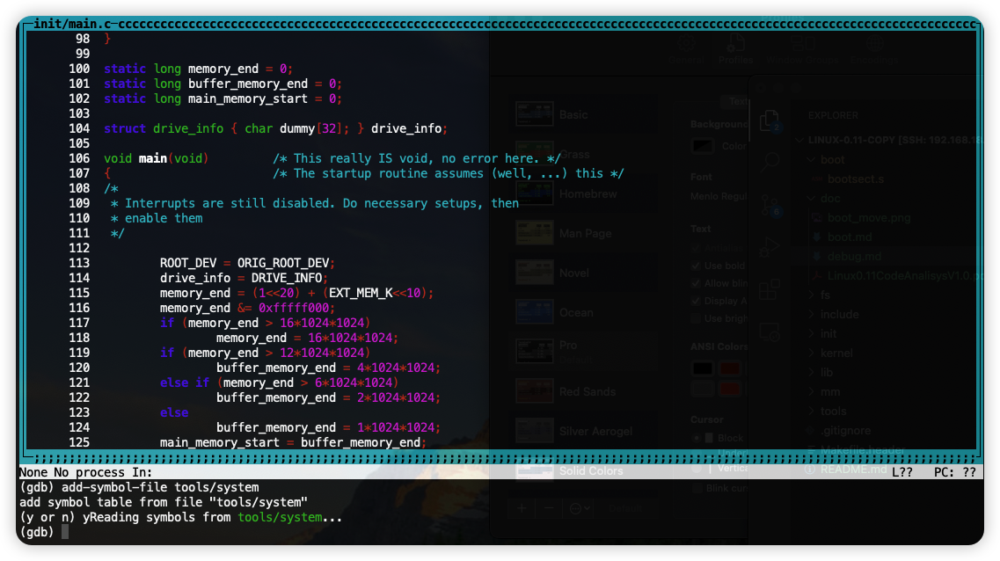

可以使用bochs或者qemu+gdb的方式进行运行，主要区别是，bochs可以很容易的调试汇编代码，而gdb调试c语言更为方便
# bochs
## 安装
bochs下载链接为
```html
https://versaweb.dl.sourceforge.net/project/bochs/bochs/2.7/bochs-2.7.tar.gz
```
解压后编译安装，我的编译命令为
```shell
./configure --enable-debugger --with-x11 --with-wx --enable-disasm --enable-all-optimizations --enable-readline --enable-x86-debugger --enable-a20-pin --enable-fast-function-calls

make && sudo make install
```
## 配置bochsrc
bochs 在安装好后需要进行配置（原本的不可用），我的配置文件为[bochsrc-hd-dbg.bxrc](../tools/bochs/bochsrc/bochsrc-hd-dbg.bxrc)
其中需要注意的点如下
```shell
# 设置图形库为x，同时打开gui调试窗口，方便查看信息
display_library: x,options="gui_debug" 

# 以下两条使用bochs生成的路径有问题需要手动修改到正确的位置
romimage: file=/usr/local/share/bochs/BIOS-bochs-latest 
vgaromimage: file=/usr/local/share/bochs/VGABIOS-lgpl-latest

# 设置软盘为我们生成的kernel镜像
floppya: 1_44="Image", status=inserted

# 添加跟文件系统镜像硬盘
ata0-master: type=disk, path="hdc-0.11.img", mode=flat, cylinders=121, heads=16, spt=63

# 设置启动磁盘为软盘
boot: floppy

# 打开魔术断点 可以使用 xchgw %bx, %bx 指令让bochs运行到这个位置自动停止 
magic_break: enabled=1
## 启动
```
启动命令如下
```shell
make bochs-debug
```
启动后即可点击continue进行运行，bochs可以单步调试汇编代码

## 调试
bochs可以在gui界面中查看以下内容
- 寄存器
- 物理内存
- 虚拟内存
- stack
- GDT
- IDT
- page Table

同时也可以 通过以下方法进行调试
- 魔术断点 `chgw %bx, %bx`
- 手动添加断点，选中一行汇编代码， 按下`F6`即可打上断点

# gdb + qemu
## 安装

需要安装`gdb-multiarc`以及`qemu`
```shell
sudo apt install gdb-multiarc qemu-system-x86_64
```
## 调试
安装完成后进入`Linux-0.11`目录，使用如下命令打开`gdb-multiarc`，
```shell
gdb-multiarc --tui
```
此时打开的`gdb`调试界面没有加载符号表，加载符号表
```shell
add-symbol-file tools/system
```
加载完成后效果如下

在另外一个shell中编译并运行qemu虚拟机
```shell
make && make debug
```
此时qemu虚拟机会等待gdb连接

回到`gdb`，并输入如下指令连接到qemu虚拟机
```shell
target remote :1234
```
开始执行
```shell
run
```
## gdb常用命令
- `r` 或者`run`开始执行，一直执行或者执行到断点
- `b file:func`或者`b file:line`给`file`中的某个函数或者某个程序打断点
- `clear file:func`或者`clear file:line`清理断点
- `l file:line`或者`l file`展示`file`中的代码
- `info breakpoint`列出断点信息
- `p variable`打印变量信息，也可以答应寄存器信息,例如`p /x $eax`,以16进制方式显示eax寄存器的值
- `x/<n/f/u> <addr>`打印内存信息 其中`n`为打印的数量，`f`为显示格式,`u`为每组显示的字节数，`addr`为内存地址, 例如`x/16xw 0x7c000`打印0x7c000处16组4字节的数据，以16进制显示
- `kill`杀死当前运行的进程
## 调试1号进程
在qemu中当前查到的资料是无法直接调试子进程，当前的方法是，由于进程的执行是在sechdule后开始的，因此可以在sechdule的最后一行加上断点，然后单步执行到fork返回，即跳入到了1号进程