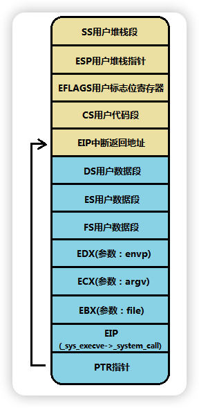

execve是一个及其重要的系统调用，用于加载可执行文件
# 函数原型
```c++
_syscall3(int,execve,const char *,file,char **,argv,char **,envp)

int execve(const char * file,char ** argv,char ** envp)
{
long __res;
__asm__ volatile ("int $0x80"
	: "=a" (__res)
	: "0" (__NR_execve),"b" ((long)(file)),"c" ((long)(argv)),"d" ((long)(envp)));
if (__res>=0)
	return (int) __res;
errno=-__res;
return -1;
}
```
# 执行体
```s
.align 2
sys_execve:
	lea EIP(%esp),%eax // 将执行execve的eip放在eax中传入给do_execve
	pushl %eax
	call do_execve // 调用call时会将下一条指令的eip放入到 栈中
	addl $4,%esp // 恢复栈
	ret
```
在调用do_execve之前此时的stack如下



如图中所示,其中栈顶PTR指针指向的是EIP中断返回的地址，栈顶上一个参数EIP只想的是system_call 调用 sys_execve的下一条指令地址

```c++
// tmp = 0x7991
int do_execve(unsigned long * eip,long tmp,char * filename,
	char ** argv, char ** envp)
{
	struct m_inode * inode;
	struct buffer_head * bh;
	struct exec ex;
	unsigned long page[MAX_ARG_PAGES];
	int i,argc,envc;
	int e_uid, e_gid;
	int retval;
	int sh_bang = 0;
	unsigned long p=PAGE_SIZE*MAX_ARG_PAGES-4;

	if ((0xffff & eip[1]) != 0x000f) // eip[1] = cs
		panic("execve called from supervisor mode");
	for (i=0 ; i<MAX_ARG_PAGES ; i++)	/* clear page-table */
		page[i]=0;
	if (!(inode=namei(filename)))		/* get executables inode */
		return -ENOENT;


```
