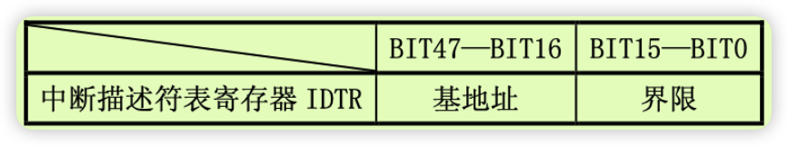
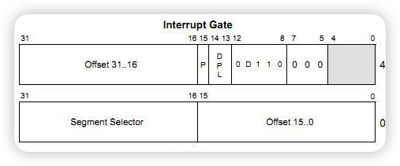
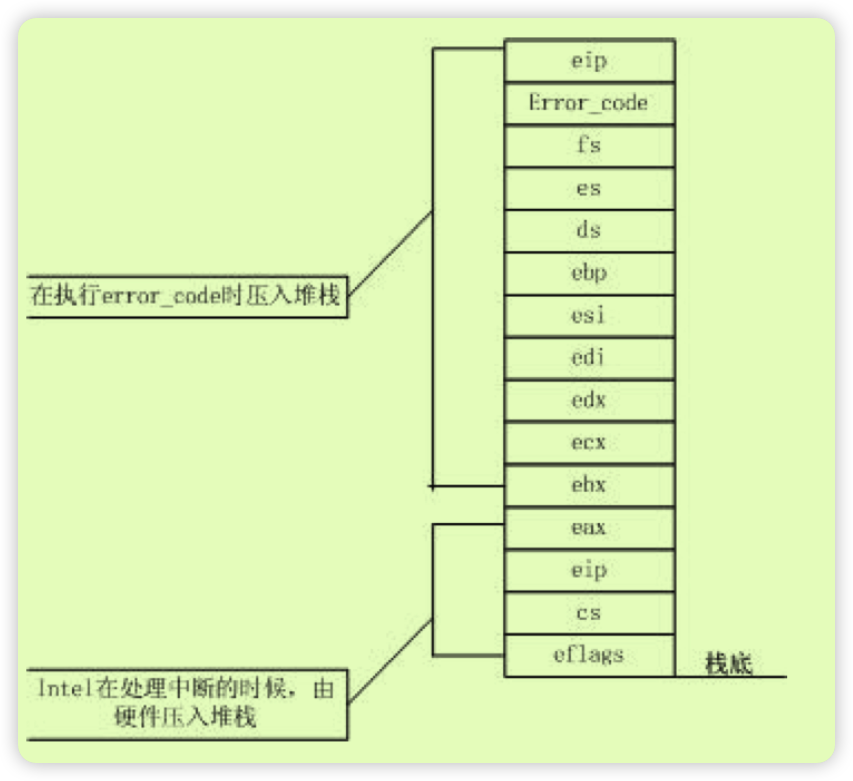

# 介绍
中断系统是是操作系统中比较重要的部分，用户态，内核态切换；进程切换；输入；程序错误处理；等等都依赖于中断系统
## 中断概念
中断依据来源不同，分为内部中断以及外部中断，由cpu内部产生的中断为内部中断，由外部中断控制器发送给CPU的中断为外部中断，外部中断称为`中断`，内部中断称为`异常`。

异常是 80386 在执行指令期间检测到不正常的或非法的条件所引起的。异常与正执行的指令有直接的联系。例如，执行除法指令时，除数等于0。再如，执行指令时发现特权级不正确。当发生这些情况时，指令就不能成功完成。软中断指令“INT n“和”TNTO“也归类与异常而不称为中断，这是因为执行这些指令产生异常事件。

依据引起异常的程序是否可被被恢复，以及恢复点的不同，将异常分为故障(Fault),陷阱(Trap), 以及中止(Abort)
- `故障`通常是可以纠正的，比如，当处理器执行一个访问内存的指令时，发现那个段或者页不在内存中（P=0），此时，可以在异常处理程序中予以纠正（分配内存，或者执行磁盘的换入换出操作），返回时，程序可以重新启动并不失连续性。
- `陷阱`是在引起异常的指令之后，把异常情况通知给系统的一种异常。陷阱中断通常在执行了截获陷阱条件的指令之后立即产生，如果陷阱条件成立的话。陷阱通常用于调试目的，包括调试陷阱、单步中断指令 int3 、溢出检测指令 into。陷阱中断允许程序或者任务在从中断处理过程返回之后继续进行而不失连续性。因此，当此异常发生时，在转入异常处理程序之前，处理器在栈中压入陷， 截获指令的下一条指令的地址。
陷阱最重要的用途是在`用户程序和内核之间提供系统调用接口`。陷阱总返回到当前指令的下一条指令。
- `中止`标志着最严重的错误，诸如硬件错误、系统表（GDT， LDT等）中的数据不一致或者无效，主要包括 双重故障异常(异常8)、协处理器段越界(异常9)。这类异常总是无法精确地报告引起错误的指令的位置，在这种错误发生时，程序或者任务都不可能重新启动。
## 中断向量表(IDT)
操作系统不会去区分中断的类型，都会在中断向量表中统一处理，对应的操作不同。

与GDT类似，在整个操作系统中只有一个IDT，IDTR寄存器记录了IDT在内存中的位置，其结构如下



中断描述符结构如下


## 中断向量表对应关系
中断描述符表的前面0x20由cpu预留

 前面17个如下所示


# 设置中断描述符
## 初始化
中断的初始化在[head.s](./boot.md#将中断处理函数置为默认)中，主要是将所有的(256个)设置为ignore_int
## 重新设置处理程序
设置如下
```c++
kernel/chr_drv/console.c:	set_trap_gate(0x21,&keyboard_interrupt);
kernel/blk_drv/floppy.c:	set_trap_gate(0x26,&floppy_interrupt);
kernel/blk_drv/hd.c:	set_intr_gate(0x2E,&hd_interrupt);
kernel/sched.c:	set_intr_gate(0x20,&timer_interrupt);
kernel/sched.c:	set_system_gate(0x80,&system_call);
kernel/traps.c:	set_trap_gate(0,&divide_error);
kernel/traps.c:	set_trap_gate(1,&debug);
kernel/traps.c:	set_trap_gate(2,&nmi);
kernel/traps.c:	set_system_gate(3,&int3);	/* int3-5 can be called from all */
kernel/traps.c:	set_system_gate(4,&overflow);
kernel/traps.c:	set_system_gate(5,&bounds);
kernel/traps.c:	set_trap_gate(6,&invalid_op);
kernel/traps.c:	set_trap_gate(7,&device_not_available);
kernel/traps.c:	set_trap_gate(8,&double_fault);
kernel/traps.c:	set_trap_gate(9,&coprocessor_segment_overrun);
kernel/traps.c:	set_trap_gate(10,&invalid_TSS);
kernel/traps.c:	set_trap_gate(11,&segment_not_present);
kernel/traps.c:	set_trap_gate(12,&stack_segment);
kernel/traps.c:	set_trap_gate(13,&general_protection);
kernel/traps.c:	set_trap_gate(14,&page_fault);
kernel/traps.c:	set_trap_gate(15,&reserved);
kernel/traps.c:	set_trap_gate(16,&coprocessor_error);
kernel/traps.c:	set_trap_gate(45,&irq13);
kernel/traps.c:	set_trap_gate(39,&parallel_interrupt); // 并口
```
其中门设置函数宏定义如下
```c++
/*
typedef struct gate_t
{
    u16 offset0;    // 段内偏移 0 ~ 15 位
    u16 selector;   // 代码段选择子
    u8 reserved;    // 保留不用
    u8 type : 4;    // 任务门/中断门 14 /陷阱门 15
    u8 segment : 1; // segment = 0 表示系统段
    u8 DPL : 2;     // 使用 int 指令访问的最低权限
    u8 present : 1; // 是否有效
    u16 offset1;    // 段内偏移 16 ~ 31 位 (not used in linux 0.11, used in high level cpu)
} _packed gate_t;   // 64bit
*/
#define _set_gate(gate_addr,type,dpl,addr) \
__asm__ ("movw %%dx,%%ax\n\t" \ // eax = 0x00080000 + addr
	"movw %0,%%dx\n\t" \
	"movl %%eax,%1\n\t" \ // code selecotr(8) offset0=addr
	"movl %%edx,%2" \ //set to 32-47bit(reserved,type,segment,dpl,present)
	: \
	: "i" ((short) (0x8000+(dpl<<13)+(type<<8))), \ // set type, dpl=0(ring0 cpu) present=1
	"o" (*((char *) (gate_addr))), \ // offset0
	"o" (*(4+(char *) (gate_addr))), \ // reserved
	"d" ((char *) (addr)),"a" (0x00080000))
// 中断门会将中断关闭
#define set_intr_gate(n,addr) \
	_set_gate(&idt[n],14,0,addr)

// 陷阱门
#define set_trap_gate(n,addr) \
	_set_gate(&idt[n],15,0,addr)
// 调用门，dpl=3 用户态也可调用
#define set_system_gate(n,addr) \
	_set_gate(&idt[n],15,3,addr)

```

# 异常处理
异常处理主要分为3个阶段
- 进入阶段：汇编代码，对栈的处理
- 处理阶段：c语言，处理
- 退出阶段：退出阶段，还原栈以及处理信号（系统调用中有）

异常处理的进入阶段和退出阶段主要分为2类 
- 中断，其栈设定大致如下
    
    其中部分中断有错误号，有的没有没有的就将error code设置为0，两种类似
有错误码的调用过程如下
```s
error_code:
	xchgl %eax,4(%esp)		# error code <-> %eax 设置栈
	xchgl %ebx,(%esp)		# &function <-> %ebx
	pushl %ecx
	pushl %edx
	pushl %edi
	pushl %esi
	pushl %ebp
	push %ds
	push %es
	push %fs
	pushl %eax			# error code
	lea 44(%esp),%eax		# offset
	pushl %eax
	movl $0x10,%eax
	mov %ax,%ds
	mov %ax,%es
	mov %ax,%fs
	call *%ebx # 调用阶段
	addl $8,%esp   #退出阶段
	pop %fs
	pop %es
	pop %ds
	popl %ebp
	popl %esi
	popl %edi
	popl %edx
	popl %ecx
	popl %ebx
	popl %eax
	iret

invalid_TSS:
	pushl $do_invalid_TSS #将处理阶段的函数压入栈中
	jmp error_code
```
## 系统调用
系统调用是用户态内核态的接口。在发送int 80中断后会切换栈，以fork为例,可以看到在`int 80`前后ebp没有变化，但是对应的esp有较大的变化，其栈顶由用户地址转换为16M以内的地址
```c++
#include <stdlib.h>
#define BMB() __asm__("xchgw %bx, %bx")
int main(){
	BMB();
	fork();
	printf("Hello, Word!\n");
	return 0;
}

// 0x 1 00 00 00 #16MB
// 0x03 ff fe f4
// 0x00 fa cf ec
// fork 前（esp 0x3fffef4 ebp 0x3fffef8）

// fork 后 (esp 0x00facfec ebp 0x3fffef8)
```

### 系统调用代码
其代码逻辑如下
```s
.align 2
bad_sys_call: # error call number
	movl $-1,%eax
	iret
.align 2
reschedule:
	pushl $ret_from_sys_call
	jmp schedule
.align 2


# 进入system call 

bad_sys_call: # error call number
	movl $-1,%eax
	iret

reschedule:
	pushl $ret_from_sys_call
	jmp schedule

system_call:
	cmpl $nr_system_calls-1,%eax // 比较 传入的中断号是否大于最大的
	ja bad_sys_call // 如果比最大的中断号大就跳入 bad_sys_call
	push %ds // 构造 栈
 	push %es
	push %fs
	# system call parameters 0-3 parameters
	pushl %edx
	pushl %ecx		# push %ebx,%ecx,%edx as parameters
	pushl %ebx		# to the system call
	# 设置ds es如内核段
	movl $0x10,%edx		# set up ds,es to kernel space
	mov %dx,%ds
	mov %dx,%es
	// 设置fs 为用户态代码段
	movl $0x17,%edx		# fs points to local data space
	mov %dx,%fs
	
	// 通过数组获取函数指针
	call *sys_call_table(,%eax,4) # sys_call_table + eax * 4 查询系统调用对应的函

	// 调用后处理
	pushl %eax
	movl current,%eax // 比较当前task_struct 的运行状态，如果不是running就跳到 schedule
	cmpl $0,state(%eax)		# state if the state of current is not ready(0), jmp to  
	jne reschedule // 比较 当前任务的counter，如果当前的时间片没有就跳入
	cmpl $0,counter(%eax)		# counter if the time of current is out, jmp to reschedule
	je reschedule

ret_from_sys_call:
	movl current,%eax		# task[0] cannot have signals
	cmpl task,%eax // 与task[0]比较 ,如果是task[0]就直接跳到3
	je 3f
	cmpw $0x0f,CS(%esp)		# was old code segment supervisor ?
	jne 3f
	cmpw $0x17,OLDSS(%esp)		# was stack segment = 0x17 ?
	jne 3f
	movl signal(%eax),%ebx
	movl blocked(%eax),%ecx
	notl %ecx
	andl %ebx,%ecx // 获取当前任务的信号并排除block信号
	bsfl %ecx,%ecx
	je 3f
	btrl %ecx,%ebx
	movl %ebx,signal(%eax)
	incl %ecx
	pushl %ecx
	call do_signal // 处理信号相关
	popl %eax
3:	popl %eax // 恢复栈
	popl %ebx
	popl %ecx
	popl %edx
	pop %fs
	pop %es
	pop %ds
	iret
```
触发系统调用主要是通过80中断触发的，通过宏定义的方式将调用号传入,函数原型入下
```c++
#define _syscall0(type,name) \
  type name(void) \
{ \
long __res; \
__asm__ volatile ("int $0x80" \
	: "=a" (__res) \
	: "0" (__NR_##name)); \
if (__res >= 0) \
	return (type) __res; \
errno = -__res; \
return -1; \
}

#define _syscall1(type,name,atype,a) \
type name(atype a) \
{ \
long __res; \
__asm__ volatile ("int $0x80" \
	: "=a" (__res) \
	: "0" (__NR_##name),"b" ((long)(a))); \
if (__res >= 0) \
	return (type) __res; \
errno = -__res; \
return -1; \
}

#define _syscall2(type,name,atype,a,btype,b) \
type name(atype a,btype b) \
{ \
long __res; \
__asm__ volatile ("int $0x80" \
	: "=a" (__res) \
	: "0" (__NR_##name),"b" ((long)(a)),"c" ((long)(b))); \
if (__res >= 0) \
	return (type) __res; \
errno = -__res; \
return -1; \
}

#define _syscall3(type,name,atype,a,btype,b,ctype,c) \
type name(atype a,btype b,ctype c) \
{ \
long __res; \
__asm__ volatile ("int $0x80" \
	: "=a" (__res) \
	: "0" (__NR_##name),"b" ((long)(a)),"c" ((long)(b)),"d" ((long)(c))); \
if (__res>=0) \
	return (type) __res; \
errno=-__res; \
return -1; \
}

```
### 重要的中断以及系统调用
- [fork系统调用](./interrupt/fork.md)
